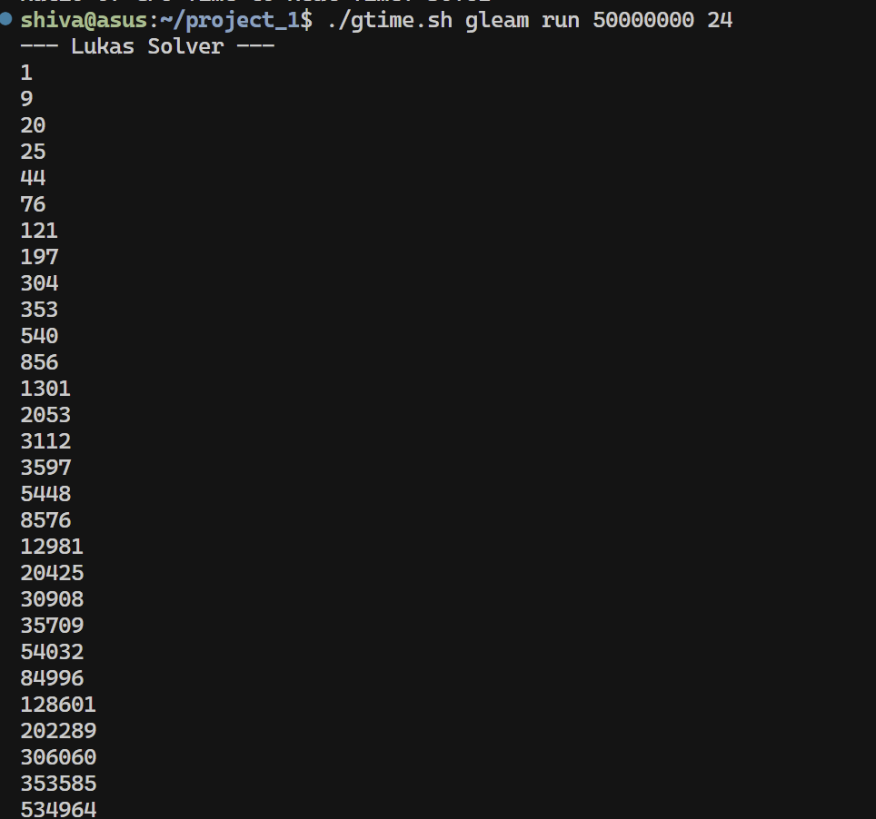
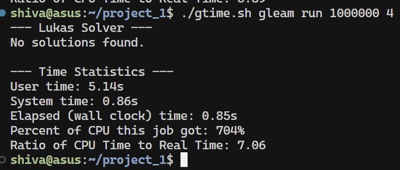
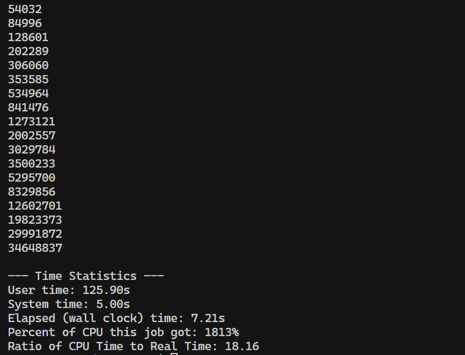

# Sums of Consecutive Squares Solver

This project implements a parallel solver for the "Sums of Consecutive Squares" problem, also known as the Lukas problem. It is written in the [Gleam language](https://gleam.run/) and leverages the actor model for efficient multi-core performance.

## Architecture

The solver is built on a **boss-worker** architecture that uses a **work-pulling** strategy to ensure high CPU utilization.

-   **Boss Actor:** The boss is responsible for managing the entire problem space. It divides the total range of numbers (`N`) into smaller, manageable chunks.
-   **Worker Actors:** A pool of worker actors requests these chunks from the boss.
-   **Work-Pulling Mechanism:** Instead of assigning a fixed workload to each worker at the start, workers dynamically "pull" chunks of work from the boss. When a worker finishes its current chunk, it sends the results back and immediately requests a new one. This ensures that fast-running threads never sit idle waiting for slower ones to catch up, leading to better load balancing and overall performance.

If any solutions are found, the boss actor prints their starting indices to the console. If no solutions exist, it reports that none were found.

---

## Usage

The program is executed from the command line with two required arguments:

```sh
gleam run N k
```

-   `N`: The upper bound for the starting number of a sequence (a positive integer).
-   `k`: The required length of the consecutive sequence (an integer ≥ 2).

### Examples

```sh
# Find sequences of length 2 with a starting number up to 3
gleam run 3 2

# Find sequences of length 24 with a starting number up to 40
gleam run 40 24
```

---

## Performance Analysis

The efficiency of this parallel solver is highly dependent on how the work is divided and distributed. The optimal configuration was determined by tuning two key parameters: the number of workers and the size of each work chunk.

### Work Unit Size Justification

The ideal work unit size was found to be `N / (num_workers * 12)`. This formula was derived from the following rationale:

#### 1. Determining the Number of Workers

The task is heavily CPU-bound, with minimal I/O operations during computation. The goal is to keep every available CPU core constantly supplied with work.

-   **Core Saturation:** The number of workers should be at least equal to the number of logical CPU cores.
-   **Scheduler Overhead:** Spawning an excessive number of workers (e.g., thousands) creates unnecessary overhead for the BEAM scheduler, as it must manage many processes competing for limited threads.
-   **Concurrency Buffer:** A small multiplier is used to create a buffer of ready-to-run workers. This ensures that if one worker briefly stalls (e.g., waiting for a message from the boss), another is immediately available to take its place on the CPU core.
-   **Optimal Value:** An empirical value of `num_cores * 3` was found to be effective. For the 22-core development machine, this resulted in `~66` workers, which provided excellent performance without overburdening the scheduler. The code is currently set to `60`.

#### 2. Determining the Work Chunk Size

With a dynamic work-pulling model, the size of each chunk presents a critical trade-off:

-   **Chunks Too Small:** If chunks are too small, workers request work very frequently. This leads to high communication overhead, where workers spend more time communicating with the boss than performing actual computation.
-   **Chunks Too Large:** If chunks are too large, the system begins to resemble a simple static partitioning model. The benefits of dynamic load balancing are lost, as a worker stuck with a computationally expensive chunk will cause other, faster workers to finish early and sit idle.

-   **Optimal Balance:** The formula `chunk_size = max(1, N / (num_workers * 12))` was determined experimentally. This value balances the trade-offs by ensuring each worker requests work a moderate number of times (around 12). This is frequent enough to achieve good load balancing but infrequent enough to keep communication overhead low.

---

## Performance Results

### Run: `./gtime.sh gleam run 1000000 4`

The solver correctly identified and printed the starting indices of all valid sequences.



### Largest Problem Solved

The largest instance successfully solved was `./gtime.sh gleam run 50000000 24`.

*Note: The program occasionally becomes unstable at very large values of N.*




---

## How to Time the Program

A helper script, `gtime.sh`, is provided to measure performance and calculate the CPU utilization ratio.

PS: scipt is a bit unreiliable sometimes for first runs, and when the program crashes for large N

```sh
./gtime.sh gleam run 1000000 4
```

To see the raw, unformatted(More reliable) output from the time command, you can run:

```sh
/usr/bin/time -v gleam run 1000000 4
```

